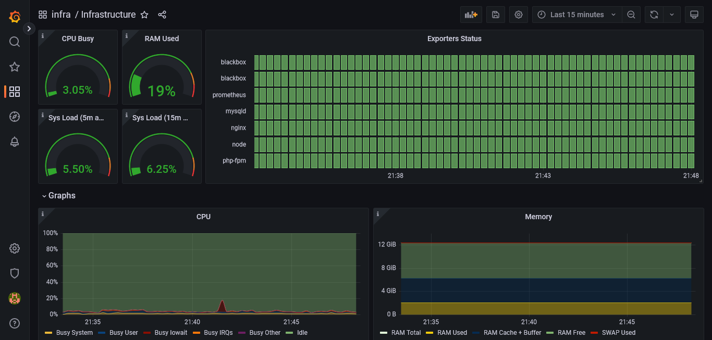
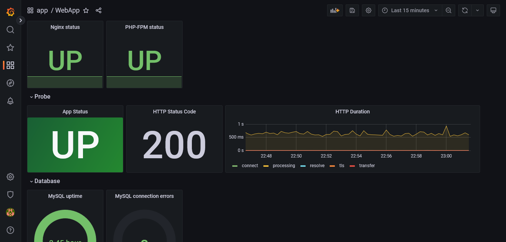

# Выполненные действия

## Подготовка окружения

* При выполнении `docker compose up -d` в папке 01_prometheus разворачивается готовое окружение из вебсервиса, экспортеров, Prometheus и Alertmanager.
* Дополнительно выполним `docker compose up -d` в папке 02_grafana, чтобы развернуть графану. Приложение будет доступно по адресу [localhost:3000](http://localhost:3000). Данные для авторизации admin:admin.

## Конфигурация

### Добавление Data Source

* Переходим Configuration -> Data Sources -> Add data source
* Выбираем Prometheus
* Конфигурация:
  * URL = <http://prometheus:9090>
  * Prometheus type = Prometheus
  * Prometheus version > 2.40.x

### Дашборд инфраструктуры

* Переходим Dashboards -> New folder и создаём папку с именем infra
* В папке создаём новый дашборд, назовем его Infrastructure
* Добавление нового виджета на дашборд происходит через кнопку Add panel
  * Далее выбираем тип панели, например Row (служит для организации элементов дашборда) и даём ему имя
  * Внутрь поместим поместим панель графика, повторив шаги выше и выбрав другой тип панели
  * Выберем необходимые метрики для графика на панели Query
  * Настроем имя графика на панели "Panel options" справа
* Повторим шаги выше для заполнения дашборда необходимыми метриками
* В конце не забудем сохранить дашборд нажав на соответствующую иконку

Пример результата на скриншоте:

### Дашборд приложения

Аналогично предыдущему разделу создадим папку с именем app и дашборд с именем WebApp для метрик приложения.

Пример результата на скриншоте:

