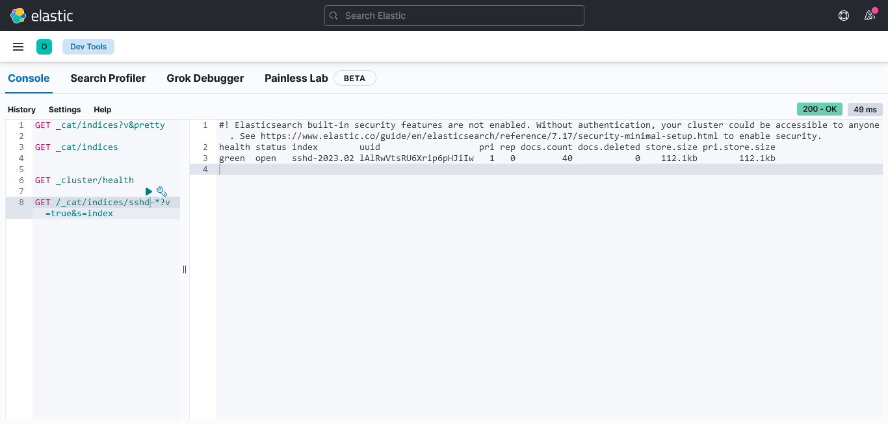
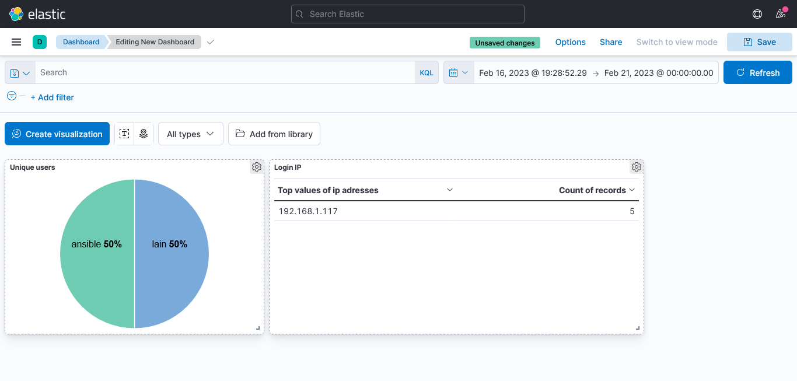

# Ответ на задание

## Конфиг rsyslog

Находится в файле [10-sshd-logstash.conf](10-sshd-logstash.conf), который должен быть помещён в папку /etc/rsyslog.d/ и состоит из двух секций: template для преобразования лога в формат json и action, который отправляет только логи sshd в logstash.

## Конфиг logstash

Пайплайн для logstash находится в поддиректории pipeline в файле [rsyslog-sshd.yml](pipeline/rsyslog-sshd.yml)

Состоит из стандартных для данного случая секций input и output и одного grok фильтра для разбора поступающих логов.

## Проверка индекса

## Дашборд приложения

Пример простого дашборда:

